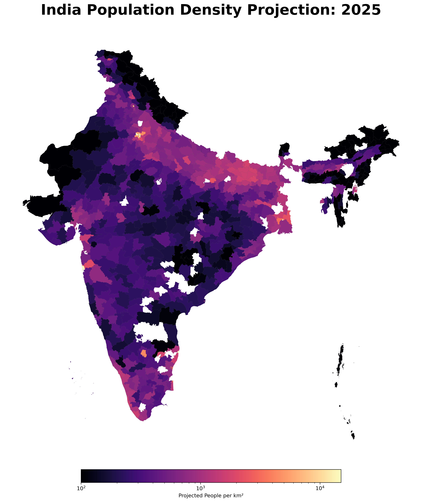
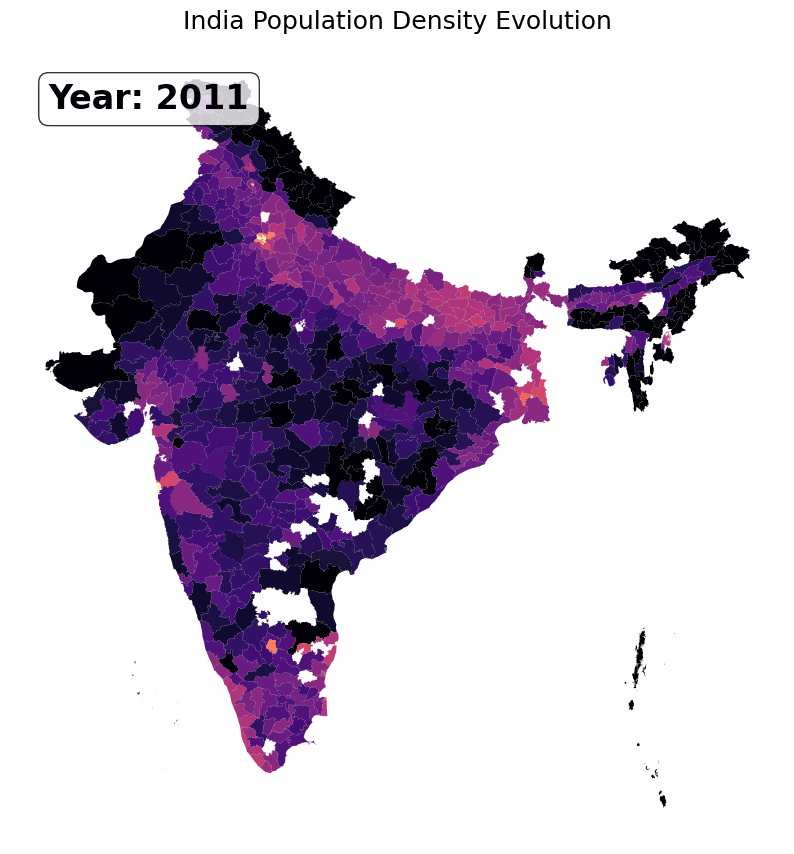
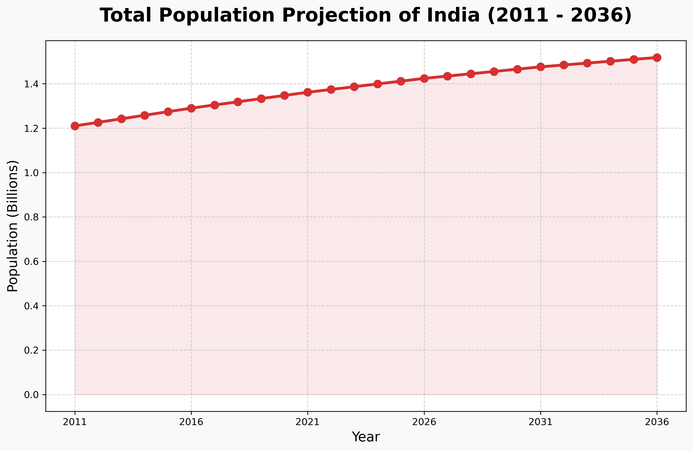
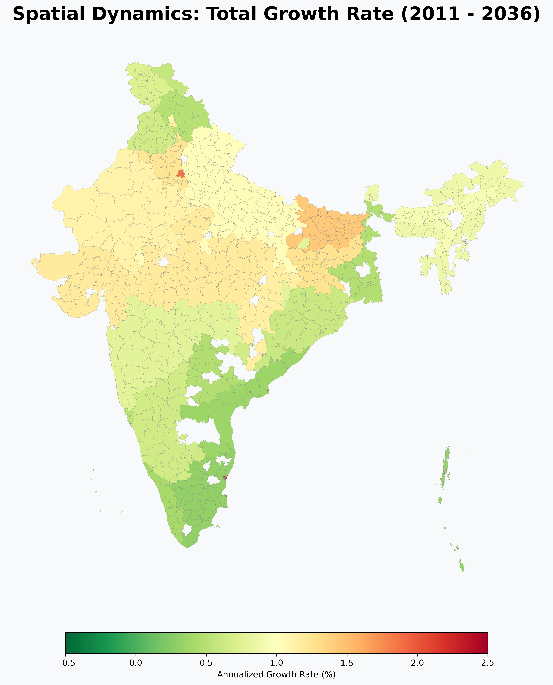

# India Population Analysis & Projections (2011 - 2036)



This repository provides a spatial and statistical framework for tracking India's demographic evolution. It reconciles the **2011 Decennial Census**, the **2021 India Policy Insights (IPI)** headcount estimates, and the official **MoHFW technical projections** through 2036.

---

## ⚠️ Data Trust & Disclaimers

It is critical to distinguish between **measured census results** and **modeled projections**. Because the 2021 Census of India was postponed, all district-level data for years after 2011 involves varying degrees of modeling and assumption.

### Data Classification
| Dataset | Frequency/Year | Status | Integrity |
| :--- | :--- | :--- | :--- |
| **Census 2011 (PCA)** | 2011 | **MEASURED** | Official ground-truth. |
| **IPI District Data** | 2016 - 2021 | **MODELED** | Estimates derived from NFHS surveys and 2011 foundations. |
| **MoHFW Projections** | 2011 - 2036 | **PROJECTED** | Official state-level demographic projections (Technical Group). |
| **Project Outputs** | 2012 - 2036 | **ASSUMED** | Model-based disaggregation (State growth applied to District weights). |

**Note on Assumptions**: The "Projected" district-level counts in this repository assume that the population distribution within a state remains proportional to the 2021 IPI weights throughout the 2021-2036 period. Real-world internal migration and localized fertility changes may vary.

---

## ✅ Validation & Sanity Check

To ensure the reliability of the modeling, we cross-checked the population denominators derived from the **IPI District Data (2021)** against the **Official MoHFW 2021 Projections**.

| Metric | Value |
| :--- | :--- |
| **Official MoHFW 2021 Projection** | 1,363,006,000 |
| **IPI Derived Total Population** | 1,362,962,963 |
| **Percentage Discrepancy** | **-0.003%** |

This extremely low gap confirms that the underlying population weights used in this repository are perfectly aligned with official national targets, providing a high degree of confidence in the disaggregated district-level outputs.

---

## 📈 Population Growth Trends

*Spatial Evolution: Detailed density transformation across 700+ districts (2011-2036).*




---

## 🛠️ Data Integration Methodology

### 1. Spatial Join (measured)
Statistical datasets are merged with **geoBoundaries (ADM2)** district polygons using standardized keys (normalized for casing and punctuation). Areas are calculated using the **EPSG:3857** projection.

### 2. Weighted Disaggregation (modeling assumption)
Official **MoHFW State-level Projections** are mapped to individual **Districts** using a top-down weighting system. The local weights are fixed based on the 2021 IPI benchmarks.

---

## 📂 Project Structure
```text
india_census_project/
├── data/
│   ├── raw/               # Downloaded CSV, XLSX, and GeoJSON files
│   └── processed/         # Unified GeoJSON and QGIS GeoPackage (.gpkg)
├── scripts/
│   ├── acquisition.py     # Batch downloader (Python 3)
│   ├── population_dynamics_analyzer.py # MAIN: Analysis, Disaggregation & Plotting
│   ├── generate_animation.py # Creates the longitudinal evolution GIF
│   └── validation.py      # Join & Match diagnostic tools
├── docs/
│   ├── teaser_density_2025.png     # Visual Teaser
│   ├── national_growth_trend.png   # Growth Line Plot
│   └── spatial_growth_dynamics.png # Growth Rate Map
└── README.md              # Documentation
```

---

## 🚀 Reproducibility: Detailed Commands

To recreate the analysis from scratch, execute the following commands in sequence:

### 1. Environment Setup
Create a virtual environment and install the required spatial and data science libraries:
```powershell
python -m venv venv
.\venv\Scripts\activate
pip install -r requirements.txt
```
*Required libraries: `pandas`, `geopandas`, `matplotlib`, `openpyxl`, `requests`, `pyogrio`.*

### 2. Data Acquisition
Download the raw datasets from mirrors (MoHFW, Harvard Dataverse, geoBoundaries):
```powershell
python scripts/acquisition.py
```
*Output: 7 files downloaded to `data/raw/` (~850MB total).*

### 3. Run Analysis & Visualization
Process the raw data, execute the weighted disaggregation model, and generate all plots:
```powershell
python scripts/population_dynamics_analyzer.py
```
*Calculations performed: District area (km²), National growth CAGR, and annual population projections (2011-2036).*

### 4. Optional: Generate Animation
Create the temporal evolution GIF shown in the dynamics section:
```powershell
python scripts/generate_animation.py
```

### 5. Verify Results
Check the spatial join accuracy and population denominator consistency:
```powershell
python scripts/validation.py
```

### 6. GIS Integration (QGIS)
The project generates a optimized GeoPackage at `data/processed/India_Census_Projections_Mapped.gpkg`. You can drag and drop this file directly into QGIS to explore all 2011-2036 density and growth attributes spatially.

---

## ⚖️ Citation & Sources
- **Measured Census**: Registrar General & Census Commissioner, India.
- **Projections**: [MoHFW Technical Group (2020)](docs/walkthrough.md).
- **Indicators**: [India Policy Insights (IPI)](https://doi.org/10.7910/DVN/7QB1BY).
- **Spatial**: [geoBoundaries ADM2](https://www.geoboundaries.org).
